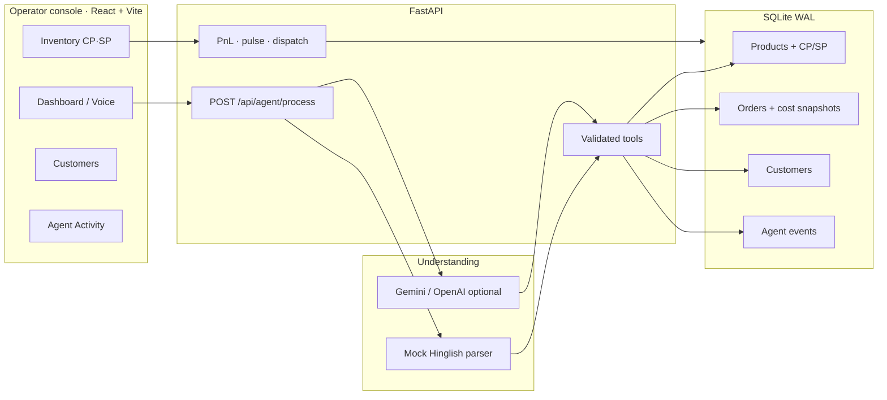

# KiranaFlow AI

### *Boliye kya chahiye, baaki KiranaFlow sambhale.*

[](https://github.com/priyanshujaiswal17/kiranaflow-ai)
[](#tech-stack)
[](#mvp-features)
[](LICENSE)

> India has millions of kirana stores. Most still take orders on memory, WhatsApp chaos, and a paper notebook.  
> **KiranaFlow is the operator that sits at the counter:** it hears the customer, picks the SKU, checks stock, bills at real prices, books profit, and sends a rider — against a live database, not a demo transcript.

This is **not a chatbot that talks about groceries.**  
The model never writes the database. Validated tools do.

```
CUSTOMER SPEAKS          AGENT DECIDES              STORE ACTS
───────────────          ──────────────             ──────────
"2 kilo aata bhej do" →  parse · match · choose  →  order · stock · P&L · dispatch
                         brand · substitute
                         price from SQLite
```

---

## Why this wins in a room of judges

| Typical “AI store” demo | KiranaFlow MVP |
| --- | --- |
| LLM invents prices | **Server-side price + stock.** Totals are recalculated in Python. |
| English-only prompts | **Hindi, Hinglish, English** — `2 kilo aata` = 2 kg atta |
| First match wins | **Brand pause:** Aashirvaad vs Patanjali vs Fortune — operator picks |
| Fake “profit” KPI | **CP + SP on every SKU.** Profit = `(SP − CP) × qty` + delivery fee |
| Chat only | **Full console:** orders, inventory, customers, agent trace, rider dispatch |
| Needs an API key | **Mock provider runs offline** so the demo never dies |

---

## MVP features

### 1. Voice of the mohalla — natural language orders
Type or **speak**. The operator understands:
- units (`kilo`, `kg`, `packet`, `liter`)
- mixed carts (`2 atta, 1 Fortune oil aur 3 Maggi`)
- delivery vs pickup (`ghar pe bhej dena` vs counter)
- **repeat last order** (`Pichla order dobara bhej do`)

### 2. Ambiguous SKU → human-in-the-loop brand cards
“Atta” is not a product. It is a **category**.  
When several brands match, the pipeline **stops**, shows choices, then continues with the selected SKU. No silent wrong-brand billing.

### 3. Tool-based autonomous pipeline (LLM never touches DB)
Every request is a recorded trail of agent events:

1. Request received  
2. Intent parsed  
3. Customer found or created (phone)  
4. Products searched (fuzzy + aliases)  
5. Inventory checked  
6. Out of stock → **alternatives suggested / substituted**  
7. Price loaded from DB  
8. Total calculated server-side  
9. Order created · stock deducted · cost **snapshotted** on line items  
10. Low-stock flag  
11. Bilingual confirmation (Hindi / English)  
12. Optional **rider dispatch**

Open **Agent Activity** to show judges the audit log — this is how you prove it is not a black box.

### 4. Customer intelligence from a phone number
Enter a 10-digit number → **name, address, purchase history**.  
Seeded regulars are ready for a live lookup. New numbers create a customer on the fly.

### 5. Real inventory economics — CP, SP, margin
Every product carries:
- **CP** — cost price  
- **SP** — selling price  
- **Margin %** on the inventory screen  
- stock-at-cost and **unsold margin** (money still sitting on the shelf)

Sold lines keep the cost they were billed at. History does not rewrite yesterday’s profit.

### 6. Sales **and** profit — today / week / month
Operations Center is a P&L strip, not a vanity counter:
- **Sales** · **Profit** · **Margin %** · **Orders**
- switch **Today / Week / Month**
- each confirmed order also shows **profit on this bill**

Formula the demo can defend:

```
line_profit  = (selling_price − cost_price) × quantity
order_profit = Σ line_profit + delivery_fee
```

### 7. Dispatch that actually shares two messages
After confirm:
- **Customer** gets rider name / phone / vehicle **+ bill**
- **Rider** gets customer name / phone / **address** + items + bill  

(WhatsApp-style payloads in the UI — production would send on the wire.)

### 8. Neighborhood pulse & store health
- **Mohalla pulse** — what is moving today  
- **Low stock** drill-down  
- pending deliveries  
- revenue breakdown per order  
- inventory value vs potential profit still in stock  

### 9. Works when the internet (or Gemini) does not
Default `AI_PROVIDER=mock` is a Hinglish rule engine.  
Flip to Gemini or OpenAI when you want a live model — **same tools, same DB, same prices.**

---

## 90-second judge walkthrough

Do this on [localhost:5173](http://localhost:5173) with backend on `:8000`.

| # | Say / click | What they should see |
| --- | --- | --- |
| 1 | Phone `9876543210` | Name, address, past orders |
| 2 | `2 kilo aata` | Brand cards if atta is ambiguous |
| 3 | Confirm a brand | Pipeline steps animate; stock moves |
| 4 | Confirmation | Hindi/English bill + **order profit** |
| 5 | Dispatch | Two messages: customer ↔ rider |
| 6 | P&L strip | Today / Week / Month sales **and** profit |
| 7 | Inventory | CP, SP, margin columns |
| 8 | `Pichla order dobara bhej do` | Repeat-last-order path |
| 9 | Agent Activity | Tool names, inputs, outputs |

**More prompts that land:**

```
Bhaiya 2 atta, 1 Fortune oil aur 3 Maggi bhej do.
2 packet Maggi aur ek Tata Salt ghar pe bhej dena.
3 Parle-G aur ek Amul butter chahiye.
```

---

## Architecture



**Hard rule:** the language model returns structured intent.  
`create_order`, `update_inventory`, `dispatch_order` are Python tools with server-side math.

```
backend/app/
├── agents/order_agent.py     #  pipeline orchestrator
├── tools/                    #  products, orders, dispatch
├── services/
│   ├── language_rules.py     #  kilo / atta / brand ambiguity
│   └── ai_provider.py        #  mock | gemini | openai
├── api/                      #  agent, dashboard, inventory, customers
└── database/seed.py          #  catalog + CP margins + history
```

---

## Tech stack

| Layer | Choice | Why it is in the MVP |
| --- | --- | --- |
| API | **FastAPI** | Typed tools, instant OpenAPI, easy judge demo |
| ORM | **SQLAlchemy** + SQLite WAL | Real persistence without Docker theatre |
| UI | **React 19 + TypeScript + Vite** | Operator console, not a form dump |
| Understanding | Mock parser + optional Gemini / OpenAI | Demo never blocked on a quota |
| Money | CP/SP on `products`, snapshot on `order_items` | Profit you can audit |

---

## Quick start

**Need:** Python 3.10+ · Node 18+

```bash
# 1) API  (from repo root)
cd backend
python -m pip install -r requirements.txt
cd ..
copy .env.example .env          # Windows
# cp .env.example .env          # macOS / Linux
python -m uvicorn backend.app.main:app --reload --host 0.0.0.0 --port 8000
```

```bash
# 2) Console
cd frontend
npm install
npm run dev
```

Open **http://localhost:5173** — Vite proxies `/api` → `:8000`.

First boot creates SQLite, seeds **kirana SKUs with CP/SP**, customers, riders, and history so week/month P&L is not a wall of zeros.

Default AI is **mock** (no key). For Gemini:

```
AI_PROVIDER=gemini
GEMINI_API_KEY=your_key
```

Copy from [`.env.example`](.env.example). **Never commit `.env`.**

---

## What we refused to fake

- Prices do not come from the prompt  
- Profit is not “revenue × 0.2”  
- Stock goes down when you sell  
- Out-of-stock paths suggest substitutes instead of inventing inventory  
- Dispatch is two different payloads, not one “sent!” toast  

That is the product: **an operator for a real kirana counter**, built so a judge can break it with Hinglish and still get a correct bill.

---

## License

MIT — see [LICENSE](LICENSE).

**KiranaFlow AI** · *Boliye kya chahiye, baaki KiranaFlow sambhale.*
